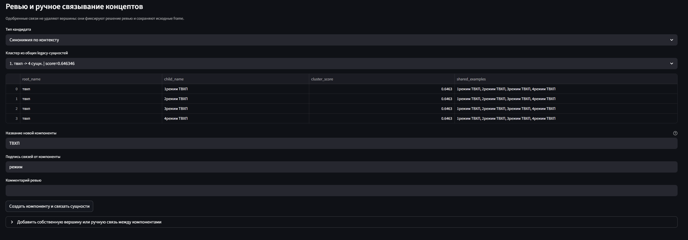
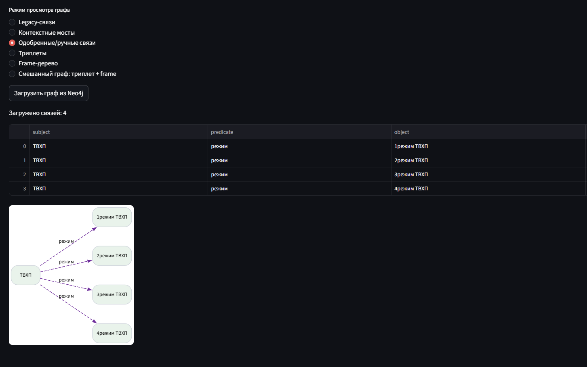

# Извлечение триплетов из CSV-таблиц

Streamlit-приложение для извлечения триплетов (`subject`, `predicate`, `object`) из CSV-таблиц, постобработки текстовых полей с построением синтаксических `frame`, сохранения в PostgreSQL + Neo4j и визуализации графа.

## Возможности

- Загрузка CSV с выбором разделителя и fallback-парсингом.
- Извлечение триплетов через локальную LLM (`llama_cpp`).
- Постобработка (`concat` / `separate`) с использованием `stanza`.
- Сохранение результатов в:
  - PostgreSQL (`documents`, `triplets`, `triplet_frames`)
  - Neo4j (узлы `Entity` и связи `RELATION`)
- Просмотр графа Neo4j в Streamlit:
  - все связи или по `document_id`
  - фильтры, дедупликация, настройки подписей
- Просмотр списка документов из PostgreSQL.
- Удаление документов по `document_id` (опционально с очисткой Neo4j).

## Структура проекта

- `app.py` - интерфейс Streamlit и интеграция с БД/графом.
- `llm_triplet_extraction.py` - извлечение триплетов из таблицы через LLM.
- `triplets_from_text_extraction.py` - NLP-постобработка и построение `frame`.
- `docker-compose.yml` - сервисы PostgreSQL + Neo4j.
- `infra/postgres/init.sql` - инициализация схемы PostgreSQL.
- `scripts/load_triplets.py` - CLI-загрузчик JSON в PostgreSQL + Neo4j.
- `requirements.txt` - зависимости приложения.

## Требования

- Python 3.10+ (рекомендуется 3.11)
- Docker Desktop (для PostgreSQL + Neo4j)
- Windows PowerShell (команды ниже в синтаксисе PowerShell)

## Быстрый старт

### 1) Перейти в папку проекта

```powershell
cd C:\Users\user\PycharmProjects\csv-table-triplet-extraction
```

### 2) Создать виртуальное окружение и установить зависимости

```powershell
python -m venv .venv
.\.venv\Scripts\Activate.ps1
pip install -r requirements.txt
```

Если PowerShell блокирует активацию:

```powershell
Set-ExecutionPolicy -Scope Process -ExecutionPolicy Bypass
```

### 3) Запустить базы данных

```powershell
docker compose up -d
```

Параметры сервисов:

- PostgreSQL: `127.0.0.1:5433`
  - БД: `triplets`
  - Пользователь: `triplets_user`
  - Пароль: `triplets_pass`
- Neo4j:
  - Browser: `http://localhost:7474`
  - Bolt: `bolt://localhost:7687`
  - Пользователь: `neo4j`
  - Пароль: `neo4jpass`

### 4) Запустить Streamlit

```powershell
streamlit run app.py
```

Обычно приложение открывается по адресу: `http://localhost:8501`

## Как пользоваться

1. Загрузите CSV.
2. Нажмите **Extract Triplets**.
3. При необходимости нажмите **Process Text In Triplets**.
4. Сохраните результат в блоке **Save To PostgreSQL And Neo4j**.
5. Посмотрите документы в блоке **Documents In PostgreSQL**.
6. Посмотрите граф в блоке **Neo4j Graph View**.

## Удаление документов

В блоке **Documents In PostgreSQL**:

1. Загрузите список документов.
2. Выберите документ по `document_id`.
3. При необходимости включите `Also delete from Neo4j`.
4. Отметьте подтверждение удаления.
5. Нажмите **Delete document**.

Удаление из PostgreSQL выполняется каскадно (включая `triplets` и `triplet_frames`).

## CLI-загрузчик (опционально)

Можно загрузить готовый `triplets.json` без UI:

```powershell
pip install -r requirements-graph.txt
python .\scripts\load_triplets.py --json .\triplets.json --source-name "my_csv.csv" --stage postprocessed
```

Ожидаемый формат JSON:

```json
{
  "triplets": [
    {"subject": "A", "predicate": "B", "object": "C"}
  ]
}
```

Также поддерживается frame-формат:

```json
{
  "triplets": [
    {
      "subject": {"text": "A", "frame": []},
      "predicate": {"text": "B", "frame": []},
      "object": {"text": "C", "frame": []}
    }
  ]
}
```

## Типовые проблемы

- `authentication failed for user "triplets_user"`:
  - обычно это подключение не к тому Postgres.
  - используйте `127.0.0.1:5433` (порт контейнера проекта).
  - при необходимости пересоздайте контейнеры:
    ```powershell
    docker compose down -v
    docker compose up -d
    ```

- Ошибка парсинга CSV (`Expected N fields...`):
  - в приложении есть fallback-парсинг; проверьте выбранный разделитель.

- Граф не отображается:
  - убедитесь, что данные сохранены в Neo4j.
  - проверьте URI/логин/пароль Neo4j в UI.

## Остановка сервисов

```powershell
docker compose down
```

С удалением томов/данных:

```powershell
docker compose down -v
```

## Оценка графа

На вкладках после извлечения доступны вкладки анализа графа и его выгрузки/загрузки. В качестве примера добавленного графа надо загрузить файл `____asd____`

### Проверка триплетов из таблиц

Таблицы из папки `tables_for_test`, с заранее определенными правилами извлечения из них триплетов в файле `test_from_table.py` служат ground truth для поиска связей в графе. При успешном поиске FP += 1, при ненахождении FN += 1.

В качестве заданных правил есть обычная таблица с строкой заголовков, выступающими объектами, и столбцом названиями, выступающими субъектами. На пересечении находятся их предикаты/связь.

Два других правила обрабатывают таблицы формата соответствий параметр;значение для вертикальных и горизонтальных таблиц.

### Найденные циклы

Поиск циклов в графе

### Корни компонент

В этом разделе указываются компоненты графа и их "корни"

### Степени вершин

Сводная таблица по степеням вершин графа

### Кандидаты на синонимические связи

Подсчет близости по эмбеддингам вершин. Однако не несет большого количества информации из-за коротких названий и типов стали/металлов и так далее. 

### Контекстные мосты между компонентами

Предполагаемые связи между компонентами

### Общие legacy-сущности по контексту

Поиск близких сущностей по контексту. Включая исходящие и входящие предикаты, соседей. и формирование возможного root_name

### Ревью и ручное связывание концептов

Можно одобрить создание новой общей вершины по legacy или создание мостов.

## Neo4j

Можно отобразить граф


##
В тестовом режиме была добавлена сущность ТВХП

